# BMAD-METHOD™ Implementation for TPDP Security Project

## 🎯 Project Overview

**Project**: TPDP Security Foundation & Architecture Enhancement  
**Framework**: BMAD-METHOD™ (Breakthrough Method for Agile AI Driven Development)  
**Goal**: Transform security development through agentic planning and context-engineered development

## 🔄 BMAD-METHOD™ Two-Phase Approach

### **Phase 1: Agentic Planning**
Dedicated AI agents collaborate to create detailed, consistent specifications:
- **Analyst Agent**: Security research and threat analysis
- **PM Agent**: Security requirements gathering
- **Architect Agent**: Technical security architecture design
- **Human-in-the-loop**: Enterprise architect oversight

### **Phase 2: Context-Engineered Development**
Scrum Master transforms plans into hyper-detailed development stories:
- **Full context embedded** in story files
- **Implementation details included**
- **Architectural guidance provided**
- **Eliminates context loss**

## 🏗️ BMAD-METHOD™ Directory Structure

```
TPDP/
├── .bmad-core/                    # BMAD-METHOD™ core configuration
│   ├── core-config.yaml          # Core configuration
│   ├── agents/                   # Agent definitions
│   └── templates/                # Document templates
├── docs/                         # Documentation
│   ├── prd.md                    # Product Requirements Document
│   ├── architecture.md           # Technical Architecture
│   ├── epics/                    # Sharded epics
│   ├── stories/                  # Development stories
│   └── qa/                       # Quality assurance
├── bmad-agents/                  # Custom TPDP agents
│   ├── security-analyst.md       # Security-specific analyst
│   ├── security-architect.md     # Security-specific architect
│   ├── security-pm.md           # Security-specific PM
│   └── security-dev.md          # Security-specific developer
└── scripts/                      # BMAD-METHOD™ scripts
    ├── bmad-init.sh             # BMAD initialization
    └── bmad-workflow.sh          # BMAD workflow management
```

## 🤖 TPDP-Specific BMAD Agents

### **Security Analyst Agent**
- **Role**: Security threat analysis and research
- **Expertise**: TPRM security requirements, compliance frameworks
- **Output**: Security brief, threat model, compliance requirements

### **Security PM Agent** 
- **Role**: Security requirements management
- **Expertise**: Security project management, risk assessment
- **Output**: Security PRD, risk-based priorities

### **Security Architect Agent**
- **Role**: Security technical architecture
- **Expertise**: Enterprise security patterns, authentication systems
- **Output**: Security architecture, implementation specifications

### **Security Dev Agent**
- **Role**: Secure implementation
- **Expertise**: Secure coding, NextAuth.js, Prisma security
- **Output**: Production-ready secure code

## 📋 BMAD-METHOD™ Workflow for TPDP

### **Step 1: Agentic Planning (Web UI)**

```mermaid
graph TD
    A["Start: TPDP Security Project"] --> B["Security Analyst: Threat Research"]
    B --> C["Security Analyst: TPRM Compliance Analysis"]
    C --> D["Security Analyst: Security Brief Creation"]
    D --> E["Security PM: Security PRD Creation"]
    E --> F["Security Architect: Security Architecture Design"]
    F --> G["Security QA: Security Test Strategy"]
    G --> H["PO: Security Document Alignment"]
    H --> I["Planning Complete → Switch to IDE"]
```



### **Step 2: Context-Engineered Development (IDE)**


## 🎯 TPDP Security BMAD-METHOD™ Benefits

### **1. Eliminates Planning Inconsistency**
- Dedicated security agents ensure consistent security requirements
- Human-in-the-loop provides enterprise oversight
- Security-specific expertise built into each agent

### **2. Eliminates Context Loss**
- Full security context embedded in each story
- Implementation details include security considerations
- Architectural guidance maintains security standards

### **3. Accelerates Security Development**
- Parallel agent work during planning phase
- Hyper-detailed stories reduce development ambiguity
- Security-specific development guidance

### **4. Ensures Security Quality**
- Security QA agent integrated from planning
- Security gates at each development phase
- Compliance verification built into workflow

## 🚀 Implementation Strategy

### **Phase 1: BMAD-METHOD™ Setup (Day 1)**
1. Install BMAD-METHOD™ framework
2. Configure TPDP-specific agents
3. Setup security document templates
4. Initialize security planning workflow

### **Phase 2: Agentic Planning (Day 1-2)**
1. Security Analyst research and brief creation
2. Security PM requirements development
3. Security Architect technical design
4. Security QA test strategy input

### **Phase 3: Context-Engineered Development (Day 2-5)**
1. Scrum Master creates security stories
2. Security Dev agents implement features
3. Security QA agents test implementations
4. Security gates and approvals

### **Phase 4: Security Integration (Day 5-6)**
1. Security feature integration
2. End-to-end security testing
3. Security documentation completion
4. Production deployment preparation

## 📊 Success Metrics with BMAD-METHOD™

### **Planning Quality Metrics**
- [ ] Security requirements completeness: 100%
- [ ] Architecture specification clarity: 100%
- [ ] Threat analysis coverage: 100%
- [ ] Compliance requirements inclusion: 100%

### **Development Quality Metrics**
- [ ] Security story implementation accuracy: 100%
- [ ] Security test pass rate: 100%
- [ ] Context loss incidents: 0
- [ ] Security gate failures: 0

### **Overall Project Metrics**
- [ ] Development time reduction: 50%
- [ ] Security vulnerability elimination: 100%
- [ ] Team efficiency improvement: 70%
- [ ] Documentation completeness: 100%

## 🛡️ Security-Specific BMAD-METHOD™ Features

### **Security Context Embedding**
- Each story contains full security context
- Threat model references included
- Compliance requirements embedded
- Security implementation patterns specified

### **Security Agent Collaboration**
- Security Analyst provides threat intelligence
- Security Architect provides implementation guidance
- Security Dev provides secure coding practices
- Security QA provides validation criteria

### **Security Quality Gates**
- Threat model validation gate
- Security architecture review gate
- Secure implementation validation gate
- Compliance verification gate

---

## 🎯 Next Steps

1. **Immediate**: Install BMAD-METHOD™ framework
2. **Today**: Configure TPDP security agents
3. **Tomorrow**: Begin agentic planning phase
4. **Day 2**: Start context-engineered development

**BMAD-METHOD™ will transform our TPDP security project from a manual, error-prone process to an automated, agent-driven security development powerhouse.**

---

*Powered by BMAD-METHOD™ - Breakthrough Method for Agile AI Driven Development*